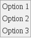
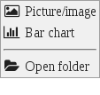
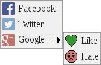
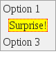

# jquery.easymenu [](https://travis-ci.org/mwri/jquery.easymenu)

jQuery menu plugin. Create menus really easy and attach them to elements, as
context menus, or by way of some other event. Supports action callbacks for
when a menu option is selected, separators, icons and sub menus.

Here are examples of a really basic menu, one with
[Font Awesome](http://fontawesome.io/) icons (by way of CSS classes), a menu
with colour image icons and a sub menu, and finally a menu with a block of
raw HTML in it:

&nbsp;&nbsp;&nbsp;&nbsp;&nbsp;&nbsp;&nbsp;&nbsp;&nbsp;&nbsp;&nbsp;&nbsp;&nbsp;&nbsp;&nbsp;&nbsp;&nbsp;&nbsp;&nbsp;&nbsp;&nbsp;&nbsp;&nbsp;&nbsp;&nbsp;&nbsp;&nbsp;&nbsp;&nbsp;&nbsp;&nbsp;&nbsp;&nbsp;&nbsp;&nbsp;&nbsp;&nbsp;&nbsp;&nbsp;&nbsp;&nbsp;&nbsp;&nbsp;&nbsp;&nbsp;&nbsp;&nbsp;&nbsp;&nbsp;&nbsp;&nbsp;&nbsp;&nbsp;&nbsp;&nbsp;&nbsp;

All these menus are shown working live in the demo (in the 'demo' folder
of the easymenu distribution). The demo is likely not to work if you
access it via the file system because the browser will hit cross
origin restrictions, so, if you are an NPM user you can run `npm install`
to install the development and demo dependencies, followed by
`./node_modules/http-server/bin/http-server demo` to run a web server
for the demo files, or otherwise you will have to copy the files to
a web server, and fix the dependencies (Easy Menu, jQuery and
[Font Awesome](http://fontawesome.io/)).

## Synopsis

Create a simple menu with three options and attach it to an element with ID
'my-thing-with-menu'. The default trigger is a 'contextmenu' event, so right
clicking the target element will display the menu, but a third parameter to
'attach' specifying the event name can change this (e.g. you could specify
'click' or 'dblclick'):

```js
let menu = $('<table/>');
$('body').append(menu);

let menu_items = [
    { label: 'Option 1', callback: function () { alert('simple menu option 1'); } },
    { label: 'Option 2', callback: function () { alert('simple menu option 2'); } },
    { label: 'Option 3', callback: function () { alert('simple menu option 3'); } },
];

menu.easymenu({ menu_items: menu_items });

menu.easymenu('attach', $('#my-thing-with-menu'));
```

## Contents

1. [Getting started](#getting-started)
   1. [Create a simple menu](#create-a-simple-menu)
2. [Additional features](#additional-features)
   1. [Adding a separator](#adding-a-separator)
   2. [Adding a header](#adding-a-header)
   3. [Adding icons](#adding-icons)
      1. [Image icons](#image-icons)
      2. [Class icons](#class-icons)
   4. [Adding a block](#adding-a-block)
   5. [Adding a sub menu](#adding-a-sub-menu)
   6. [Adding titles](#adding-titles)
   7. [Using other events](#using-other-events)
3. [Other methods](#other-methods)
   1. [show](#show)
   2. [hide](#hide)


## Getting started

### Create a simple menu

First create or reference a table element within the DOM:

```js
let menu = $('<table/>');
$('body').append(menu);
```

Turn it into a jQuery easymenu:

```js
menu.easymenu({
    menu_items: [
        { label: 'Option 1', callback: function () { alert('simple menu option 1'); } },
        { label: 'Option 2', callback: function () { alert('simple menu option 2'); } },
        { label: 'Option 3', callback: function () { alert('simple menu option 3'); } },
    ],
});
```

Attach the menu where you want it:

```js
menu.easymenu('attach', $('#my-thing-with-menu'));
```

The `menu_items` parameter passed to the `easymenu` constructor describes
the menu by way of a list of menu items. Each menu item is an object, with
various keys and values determining its characteristics.

A `type` key determines the type of a menu item, but, conspicuously missing
above, it defaults to 'option'.

Other types add different things into the menu, and other keys and values in
the object change the menu item in other ways.

## Additional features

### Adding a separator

A separator is achieved by adding a menu item of type 'separator':

```js
menu.easymenu({
    menu_items: [
        { label: 'Option 1', callback: function () { alert('simple menu option 1'); } },
        { label: 'Option 2', callback: function () { alert('simple menu option 2'); } },
        { type: 'separator' },
        { label: 'Option 3', callback: function () { alert('simple menu option 3'); } },
    ],
});
```

### Adding a header

A header is achieved by adding a menu item of type 'header':

```js
menu.easymenu({
    menu_items: [
        { type: 'header' },
        { label: 'Option 1', callback: function () { alert('simple menu option 1'); } },
        { label: 'Option 2', callback: function () { alert('simple menu option 2'); } },
        { label: 'Option 3', callback: function () { alert('simple menu option 3'); } },
    ],
});
```

This could be achieve by CSS and classes, or a [block](#adding-a-block); this
is just a convenient short hand.

### Adding icons

An icon can be added to a menu item by adding an `icon` key to it.
The value must be an object with either a `file` or `class` sub key.

#### Image icons

```js
menu.easymenu({
    menu_items: [
        { label: 'Facebook',
            icon: { file: 'facebook.jpg' },
            callback: function () { alert('Go Facebook'); }
            },
        { label: 'Twitter',
            icon: { file: 'twitter.jpg' },
            callback: function () { alert('Go Twitter'); }
            },
        { label: 'Google +',
            icon: { file: 'gplus.jpg' },
            callback: function () { alert('Go Google'); }
            },
    ],
});
```

#### Class icons

```js
menu.easymenu({
    menu_items: [
        { label: 'Picture/image',
            icon: { class: 'fa fa-picture-o' },
            callback: function () { alert('Picture/image'); }
            },
        { label: 'Bar chart',
            icon: { class: 'fa fa-bar-chart' },
            callback: function () { alert('Bar chart'); }
            },
        { label: 'Open folder',
            icon: { class: 'fa fa-folder-open' },
            callback: function () { alert('Open folder'); }
            },
    ],
});
```

### Adding a block

A menu item of type 'block' has simple the contents of the label
inserted:

```js
menu.easymenu({
    menu_items: [
        { label: 'Option 1',
            callback: function () { alert('simple menu option 1'); }
            },
        { type: 'block',
            label: '<span style="margin: 0.5em; border: 1px dotted red; background: yellow;">Surprise!</span>',
            callback: function () { alert('simple menu option 2'); }
            },
        { label: 'Option 3',
            callback: function () { alert('simple menu option 3'); }
            },
    ],
});
```

### Adding a sub menu

A sub menu is added by including a `sub_menu` key. The value must be
as the object parameter passed to construct a jQuery easymenu object:

```js
menu.easymenu({
    menu_items: [
        { label: 'Facebook',
            icon: { file: 'facebook.jpg' },
            callback: function () { alert('Go Facebook'); },
            },
        { label: 'Twitter',
            icon: { file: 'twitter.jpg' },
            callback: function () { alert('Go Twitter'); },
            },
        { label: 'Google +',
            icon: { file: 'gplus.jpg' },
            sub_menu: {
                menu_items: [
                    { label: 'Like',
                        icon: { file: 'like.png' },
                        callback: function () { alert('Like'); },
                        },
                    { label: 'Hate',
                        icon: { file: 'hate.png' },
                        callback: function () { alert('Hate'); },
                        },
                    ],
                },
            },
    ]
});
```

The value of `sub_menu` will be taken and used to create another
easymenu menu, which will be attached to the first/root menu...

### Adding titles

A title (which shows helpful information (or rude comments if you
like) when hovering over a menu item) can be added to a menu item
by including a `title` key:

```js
menu.easymenu({
    menu_items: [
        { label: 'Option 1',
            title: 'all about option 1',
            callback: function () { alert('simple menu option 1'); }
            },
        { label: 'Option 2',
            title: 'all about option 2',
            callback: function () { alert('simple menu option 2'); }
            },
        { label: 'Option 3',
            title: 'all about option 3',
            callback: function () { alert('simple menu option 3'); }
            },
    ]
});
```

### Using other events

Passing a third parameter to `attach` you can specify alternative
events. The default event is `contextmenu`, so this:

```js
menu.easymenu('attach', $('#my-thing-with-menu'));
```

Is the same as:

```js
menu.easymenu('attach', $('#my-thing-with-menu'), 'contextmenu');
```

You could however specify this:

```js
menu.easymenu('attach', $('#my-thing-with-menu'), 'click');
```

Or any other event the target element can receive...

## Other methods

### show

Show displays the menu. Because no event is involved the X and Y
position must be given:

```js
menu.easymenu('show', x, y);
```

### hide

This hides the menu:

```js
menu.easymenu('hide');
```
